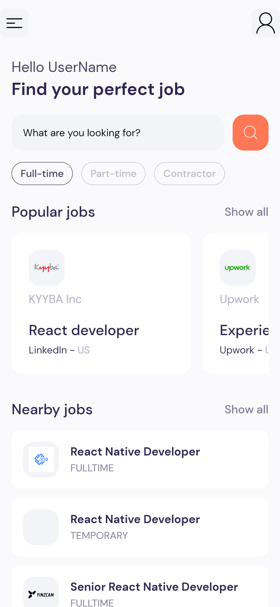
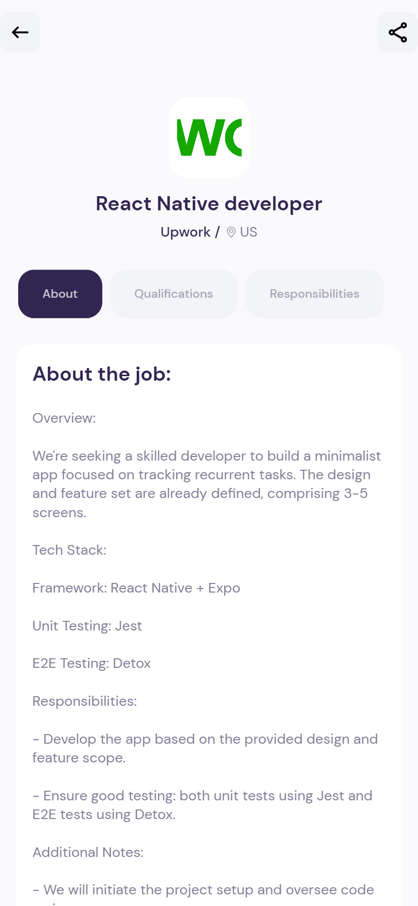
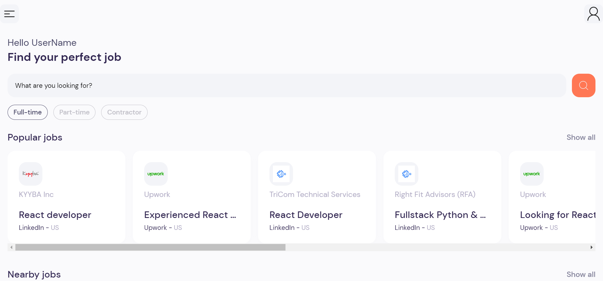

# Job App with React Native
## Screnshoots 
 

## Description 
The JobSearch app is a powerful and efficient tool for job seekers, designed and developed using the React Native framework and integrated with the Rapid API. 

## Technologies Used
React Native, Rapid API, React Hooks 
